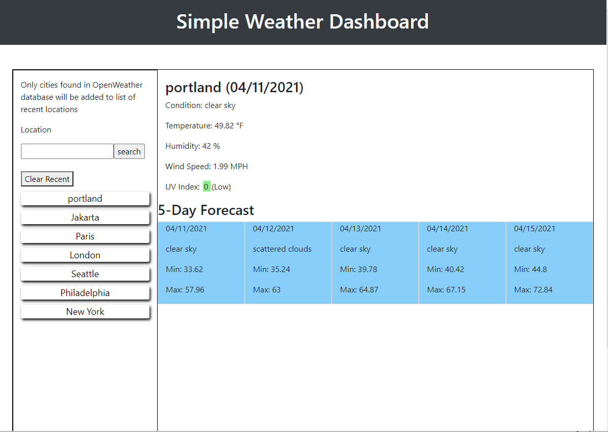

# Simple Weather Dashboard
## Description
Simple Weather Dashboard shows a few simple weather details for a location given by the user. The weather data is provided by openweathermap.org using the One Call API. 
Provide a short description explaining the what, why, and how of your project. Use the following questions as a guide:
- What was your motivation?
- Why did you build this project? (Note: the answer is not "Because it was a homework assignment.")
- What problem does it solve?
- What did you learn?

## Installation
This project has one html file (index.html), one script file (script.js) and one css files (style.css). The script.js and style.css files are in the asset folder.

## Usage
When the Simple Weather Dashboard is started the current weather and 5-day forecast of the first city in the recent city list is displayed. To get the current weather and 5-day forecast of another city enter the name into the search field and either press Enter or click the Search button. If the city is found the current weather and 5-day forcast will be shown. Then the name of that city will appear at the top of the recent city list. The list will be updated in local storage. 

If the city name is not recognized, an alert pops up and the search text field is not cleared to give the user a chance to fix the name

The UV-Index Exposure categories are given here
 https://www.epa.gov/sites/production/files/documents/uviguide.pdf

| Exposure category | UV Index |
--- | --- 
| Low | 1-2|
| Moderate | 3-5 |
| High | 6-7 |
| Very High | 8-10 |
| Extreme | 11+ |

A screenshot of the application is shown below.

## Wish list
1. Replace sky conditions (cloudy, rain, etc with an icon instead of text)
2. Use google maps api to autocomplete the search text field.
3. Refactor extensively to use bootstrap more often.
4. Test on mobile phone.
5. Clean up style.css, it is a mess.
6. Use JavaScript to write the forecast details instead of a bunch of divs

## Credits
List your collaborators, if any, with links to their GitHub profiles.
If you used any third-party assets that require attribution, list the creators with links to their primary web presence in this section.
If you followed tutorials, include links to those here as well.

## License
MIT License

Copyright (c) [year] [fullname]

Permission is hereby granted, free of charge, to any person obtaining a copy
of this software and associated documentation files (the "Software"), to deal
in the Software without restriction, including without limitation the rights
to use, copy, modify, merge, publish, distribute, sublicense, and/or sell
copies of the Software, and to permit persons to whom the Software is
furnished to do so, subject to the following conditions:

The above copyright notice and this permission notice shall be included in all
copies or substantial portions of the Software.

THE SOFTWARE IS PROVIDED "AS IS", WITHOUT WARRANTY OF ANY KIND, EXPRESS OR
IMPLIED, INCLUDING BUT NOT LIMITED TO THE WARRANTIES OF MERCHANTABILITY,
FITNESS FOR A PARTICULAR PURPOSE AND NONINFRINGEMENT. IN NO EVENT SHALL THE
AUTHORS OR COPYRIGHT HOLDERS BE LIABLE FOR ANY CLAIM, DAMAGES OR OTHER
LIABILITY, WHETHER IN AN ACTION OF CONTRACT, TORT OR OTHERWISE, ARISING FROM,
OUT OF OR IN CONNECTION WITH THE SOFTWARE OR THE USE OR OTHER DEALINGS IN THE
SOFTWARE.

